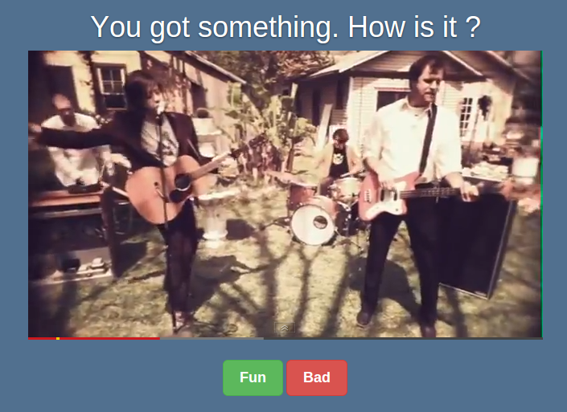

Share Me Anything
=================

*A web application social experiment*

Project by Brice Thomas written in JavaScript with Node.js, 2014

What is it ?
------------

**A fun new way to communicate**

*Share Me Anything* connects you with another **random** human connected.

Once in touch with someone, two different roles are given: a sender and a receiver.

The sender have to share an image, photo, music or video. Only one share at a time.

Then the receiver receives the share and must vote: *'Fun'* or *'Bad'*.

If it's *'Bad'*, it puts an end to the communication.

But if it's *'Fun'*, the communication goes on ! And roles are switched.

The sender becomes the receiver and the receiver becomes the sender.

And another turn begin...

Progress
--------

Still in **very early development** but it works well (for the moment).

Supported shares:

- Uploaded & URL **images, photos and animated gifs**

- **YouTube videos**

- **Vimeo videos**

In a near future:

- Musics sharing from SoundCloud

And then:

- High security

- Code optimization 

Security
--------

Currently the application is not at all secured for clients and servers.

Do **NOT** use it on production servers. 

A quick look
------------

Please, don't forget this is a prototype.

