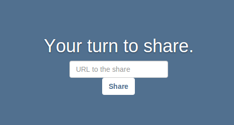

Share Me Anything
=================

*A web application social experiment*

Project by **Brice Thomas** written in JavaScript with Node.js, 2014

What is it ?
------------

**A fun new way to communicate**

*Share Me Anything* connects you with another **random** connected human.

Once in touch with someone, two different roles are given: a sender and a receiver.

The sender have to share an image, photo, music or video. Only one share at a time.

Then the receiver receives the share and must vote: *'Fun'* or *'Bad'*.

If *'Bad'*, it puts an end to the communication.

But if *'Fun'*, the communication goes on ! And roles are switched.

The sender becomes the receiver and vice versa.

And another turn begin...

Progress
--------

Still in **very early development** but it works well (for the moment).

Supported shares:

- URL **images, photos and animated gifs**

- **YouTube videos**

- **Vimeo videos**

In a near future:

- DailyMotion videos

- Musics sharing from SoundCloud (Spotify ? Deezer ?)

- Code optimization

- Better UI

A quick look
------------

Please, don't forget this is a prototype.

